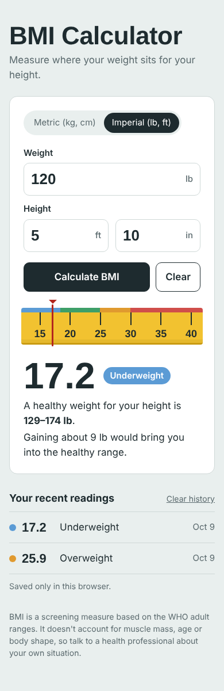

# ⚖️ BMI Calculator

A simple React app that calculates your **Body Mass Index (BMI)** from your weight and height, shows a short message about the result, and displays a matching illustration.


<p align="center"></p>

## ✨ Features

- Enter **weight in pounds (lbs)** and **height in inches (in)**
- Calculates BMI using the imperial formula: `BMI = weight ÷ height² × 703`
- Shows the result to one decimal place with a short message
- Displays a different image depending on the BMI range
- Validates input — alerts you if weight or height is missing
- **Reload** button to clear the form and start again

## 🛠️ Built With

- **React** (functional components + `useState` hook)
- **Create React App**
- Plain CSS

## 📁 Project Structure

```
src/
├── App.js       # Form, BMI calculation and result logic
├── index.js     # App entry point
├── index.css    # Styles
└── assets/      # Result illustrations
```

## 🚀 Getting Started

```bash
git clone https://github.com/Scarface96/bmi-calculator.git
cd bmi-calculator
yarn install      # or: npm install
yarn start        # or: npm start
```

Then open [http://localhost:3000](http://localhost:3000).

## 📚 What I Learned

Handling form input with React state, preventing default form submission, conditional rendering, and loading images dynamically based on state.

---

👤 **Tony Mulunda** — [GitHub @Scarface96](https://github.com/Scarface96)

## About This Project

A React application that converts user input into an immediate BMI result through a simple interactive interface. The project demonstrates component-based UI development, React state management, form handling, validation and conditional rendering.
